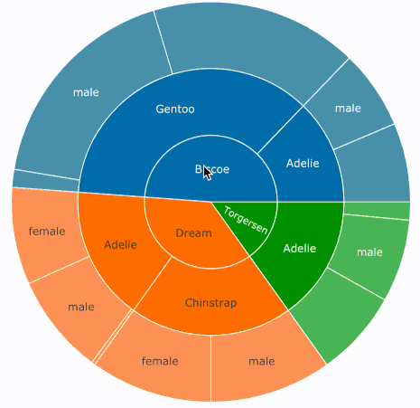
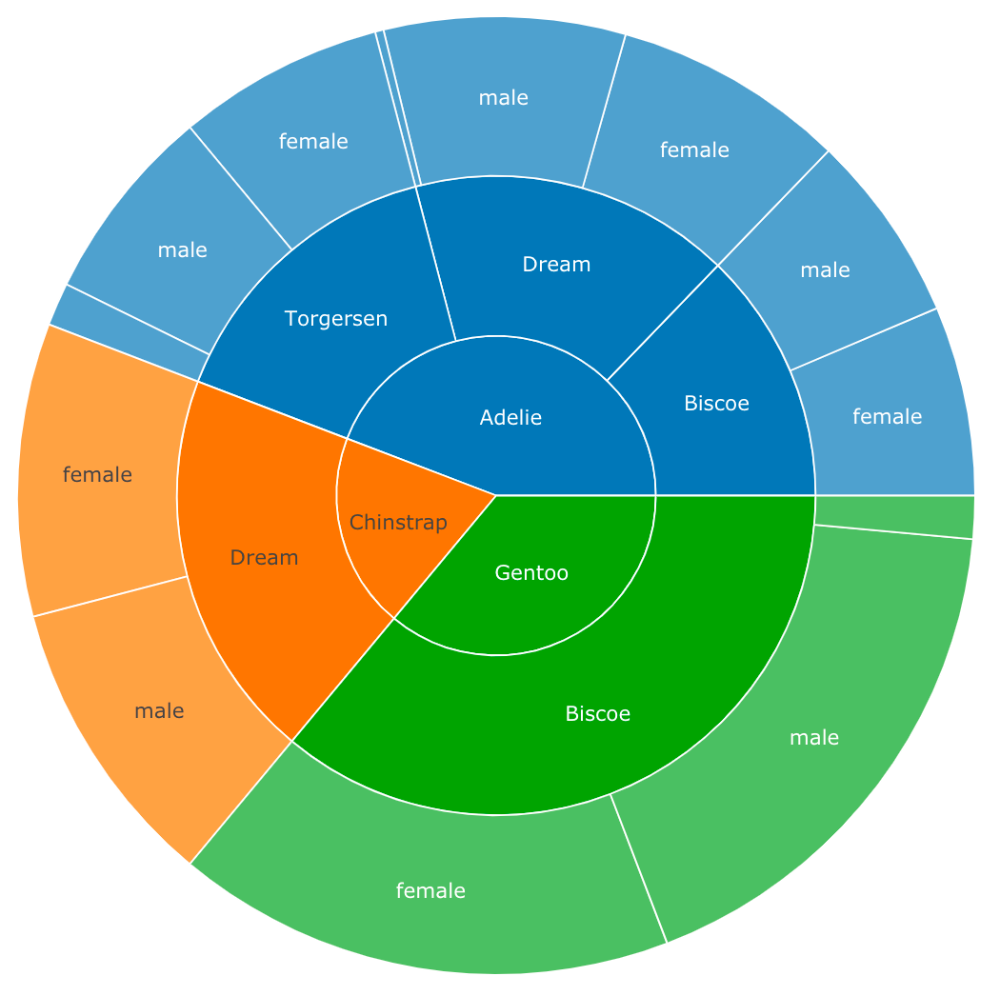
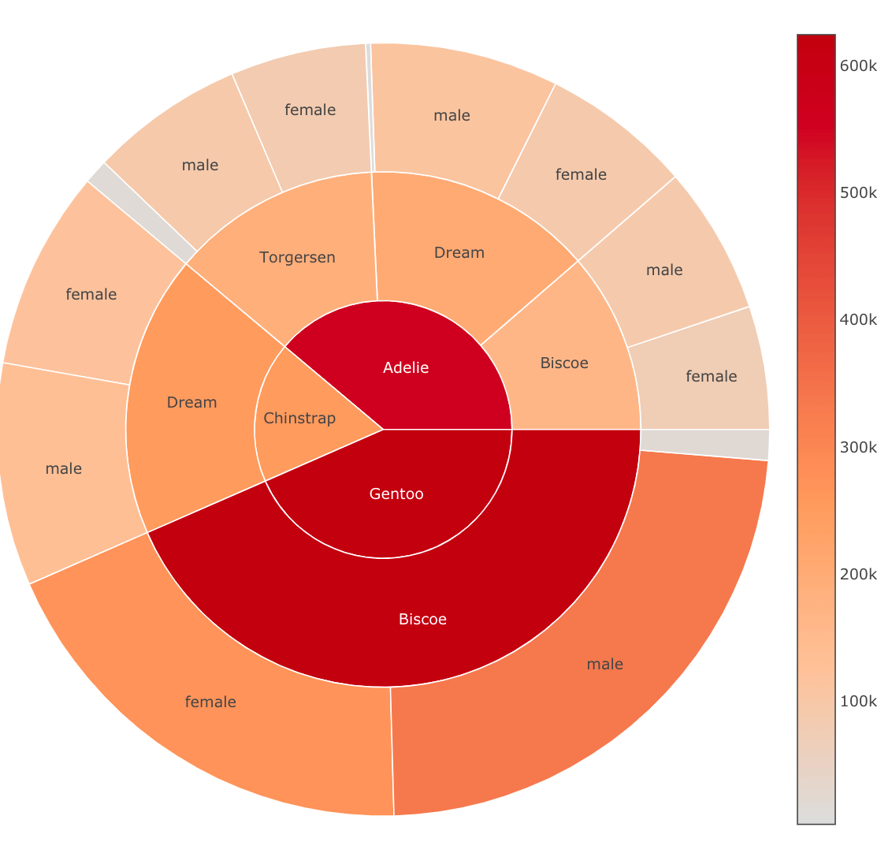

# plotme

The `{plotme}` package provides a human friendly interface for plots that are otherwise quite hard to create in R. Currently only two functions exist, to create `{plotly}` ***sunburst*** and ***treemap*** plots, but (hopefully) more is to come.

## Installation
```{r}
devtools::install_github("yogevherz/plotme")
```
## Usage

``` r
library(plotme)
library(dplyr)
library(palmerpenguins)
```

The `count_to_sunburst()` and `count_to_treemap()` functions are built to help you quickly create interactive hierarchical plots from categorical data. This can be very handy when exploring new datasets. The function expects a summary table created by `dplyr::count()`.

Quickly create a ***sunburst*** plot:

``` r
penguins %>% 
  count(island, species, sex) %>% 
  count_to_sunburst()
```



To change the hierarchy, simply change the order within the `count()` call:

``` r
penguins %>% 
  count(species, island, sex) %>% 
  count_to_sunburst()
```



Color groups by number of observations:

``` r
penguins %>% 
  count(species, island, sex) %>% 
  count_to_sunburst(fill_by_n = TRUE)
```


Make group size proportional to the sum of another variable (in this case, the sum of body mass):

``` r
penguins %>% 
  count(species, island, sex, wt = body_mass_g) %>% 
  count_to_sunburst(fill_by_n = TRUE)
```



Or easily create a ***treemap*** plot instead:

``` r
penguins %>% 
  count(species, island, sex, wt = body_mass_g) %>% 
  count_to_treemap(fill_by_n = TRUE)
```


